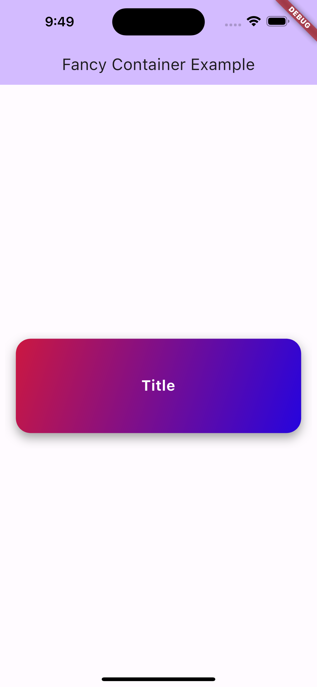

# Fancy Container Widget

This is a customizable Flutter widget that creates a fancy container with gradient background and shadow effect.



## Features

- Allows customization of width, height, colors, title, subtitle, and padding.
- Gradient background with customizable colors.
- Text customization for title and subtitle.

## Usage

To use this widget in your Flutter project, follow these steps:

1. Copy the `fancy_container.dart` file into your project's `lib` directory.

2. Import the `FancyContainer` widget wherever you want to use it:
   ```dart
   import 'package:your_project_name/fancy_container.dart';
   ```
3. Implement the FancyContainer widget with your desired parameters:

   ```dart
   FancyContainer(
   width: 300.0,
   height: 150.0,
   color1: Colors.red,
   color2: Colors.blue,
   title: "Hello",
   textColor: Colors.white,
   subtitle: "Welcome to my app",
   subtitleColor: Colors.white,
   padding: EdgeInsets.all(16.0),
   )
   ```

### Parameters

- width: Width of the container. If not provided, it defaults to 90% of the screen width.
- height: Height of the container.
- color1: Starting color of the gradient background.
- color2: Ending color of the gradient background.
- title: Title text displayed at the center of the container.
- textColor: Color of the title text.
- subtitle: Subtitle text displayed below the title.
- subtitleColor: Color of the subtitle text.
- padding: Padding around the content inside the container.

## Example

You can find an example of how to use this widget in the example directory of this repository.

Feel free to customize and extend this widget according to your needs!
